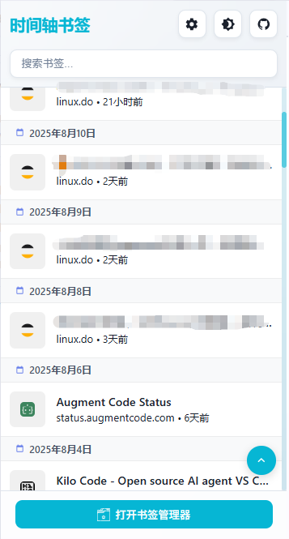
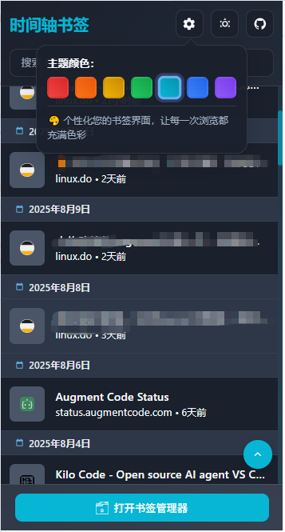

# 时间轴书签 Chrome 扩展

一个现代化的Chrome浏览器扩展，提供优雅的书签管理体验，支持分页加载、实时搜索、主题切换等功能。



## 2025-08-19 更新

### 🎯 右键菜单功能
- **智能右键菜单**: 在任何书签项目上右键点击，弹出功能菜单
- **目录路径显示**: 第一行显示书签所在的完整目录路径（如："书签栏 > 工作 > 开发工具"）
- **快速删除功能**: 第二行提供删除书签选项，点击即可安全删除书签
- **智能菜单定位**: 菜单基于书签位置智能定位，完全避免被窗口边界遮盖
- **滚动条保护**: 优化定位算法，确保菜单永不遮盖滚动条

### 🔥 联合区域检测
- **延迟消失机制**: 鼠标离开书签和菜单联合区域后，启动300ms延迟定时器
- **智能重入检测**: 延迟期间鼠标重新进入区域则取消隐藏，给用户充足反应时间
- **页面滚动检测**: 监听页面滚动事件，滚动时菜单立即消失，避免位置错乱
- **实时坐标更新**: 动态获取书签和菜单的边界坐标，支持响应式布局

### ✨ 交互体验优化
- **悬停视觉反馈**: 菜单项悬停时显示简洁的阴影效果
- **滑入箭头指示**: "所在目录"项悬停时显示滑入的箭头符号，明确表示导航功能
- **主题色适配**: 箭头颜色自动跟随当前主题，支持深色/浅色模式
- **无缝视觉设计**: 优化菜单间距，消除割裂感，实现完美的视觉一体化

### 🛡️ 稳定性增强
- **多重错误处理**: 完善的异常捕获和回退机制，确保功能稳定运行
- **边界检测优化**: 智能处理各种边界情况，包括长目录名称和极端位置
- **内存泄漏预防**: 及时清理定时器和事件监听器，优化性能表现

---
**📅 2025-08-19 更新结束** - 以上为本次更新的全部内容

## ✨ 主要特性

### 🚀 核心功能
- **智能显示**: 按日期降序显示最新添加的书签
- **分页加载**: 初始显示20条书签，滚动自动加载更多
- **快速访问**: 点击扩展图标即可打开popup窗口
- **书签管理**: 提供快速打开Chrome原生书签管理器的入口

### 🎨 界面设计
- **现代化UI**: 采用glassmorphism设计风格
- **渐变背景**: 美观的渐变色背景
- **圆角设计**: 现代化的圆角元素
- **响应式布局**: 自适应不同屏幕尺寸
- **流畅动画**: 丰富的hover效果和加载动画

### 🌙 主题支持
- **深色主题**: 护眼的深色模式
- **浅色主题**: 清爽的浅色模式
- **主题切换**: 一键切换主题
- **主题记忆**: 自动保存用户偏好

### 🔍 搜索功能
- **实时搜索**: 输入即搜索，无需等待
- **智能匹配**: 支持书签标题和URL搜索
- **搜索高亮**: 搜索结果关键词高亮显示
- **快速清除**: 一键清除搜索内容

### ⚡ 性能优化
- **懒加载**: 图标懒加载，提升性能
- **虚拟滚动**: 大量书签时的性能优化
- **缓存机制**: 智能缓存，减少重复请求
- **错误处理**: 完善的错误处理和用户反馈

## 📦 安装方法

### 方法一：开发者模式安装（推荐）

1. **下载源码**
   ```bash
   git clone https://github.com/changingshow/Bookmark-Timeline.git
   cd smart-bookmark-manager
   ```

2. **打开Chrome扩展管理页面**
   - 在Chrome地址栏输入：`chrome://extensions/`
   - 或者通过菜单：更多工具 → 扩展程序

3. **启用开发者模式**
   - 点击右上角的"开发者模式"开关

4. **加载扩展**
   - 点击"加载已解压的扩展程序"
   - 选择项目文件夹
   - 扩展将自动安装并激活

### 方法二：打包安装

1. **打包扩展**
   - 在扩展管理页面点击"打包扩展程序"
   - 选择项目根目录
   - 生成.crx文件

2. **安装扩展**
   - 将.crx文件拖拽到扩展管理页面
   - 确认安装

## 🚀 使用指南

### 基本使用

1. **打开扩展**
   - 点击浏览器工具栏中的书签图标
   - 或使用快捷键（如果设置了的话）

2. **浏览书签**
   - 书签按添加时间降序排列
   - 滚动到底部自动加载更多书签
   - 点击书签项即可打开对应网页

3. **搜索书签**
   - 点击搜索图标或使用快捷键
   - 输入关键词进行实时搜索
   - 支持搜索书签标题和URL

### 高级功能

1. **主题切换**
   - 点击右上角的主题切换按钮
   - 支持深色和浅色两种主题
   - 主题设置会自动保存

2. **书签管理**
   - 点击底部"打开书签管理器"按钮
   - 跳转到Chrome原生书签管理页面
   - 进行高级书签管理操作

3. **右键菜单**
   - 在网页上右键可快速添加书签
   - 支持添加当前页面或链接到书签

## 🛠️ 技术架构

### 技术栈
- **Manifest V3**: 使用最新的Chrome扩展标准
- **原生JavaScript**: ES6+语法，async/await
- **现代CSS**: CSS Grid、Flexbox、CSS Variables
- **Chrome APIs**: bookmarks、storage、tabs等API

### 文件结构
```
smart-bookmark-manager/
├── manifest.json          # 扩展配置文件
├── popup.html             # 弹窗页面
├── popup.css              # 样式文件
├── popup.js               # 主要逻辑
├── background.js          # 后台脚本
├── icons/                 # 图标文件夹
│   ├── icon16.png
│   ├── icon32.png
│   ├── icon48.png
│   ├── icon128.png
│   └── folder.png
└── README.md              # 说明文档
```

### 核心类和方法

#### BookmarkManager 类
- `constructor()`: 初始化管理器
- `loadBookmarks()`: 加载书签数据
- `renderBookmarks()`: 渲染书签列表
- `handleSearch()`: 处理搜索功能
- `toggleTheme()`: 切换主题
- `handleScroll()`: 处理滚动加载

## 🎯 功能特性详解

### 1. 分页加载机制
- 初始加载20条书签
- 滚动到底部时自动加载下一批
- 支持无限滚动
- 加载状态指示器

### 2. 搜索功能
- 实时搜索，无延迟
- 支持中英文搜索
- 搜索结果高亮显示
- 搜索历史记录（可选）

### 3. 主题系统
- 基于CSS Variables实现
- 支持系统主题跟随
- 平滑的主题切换动画
- 主题设置持久化存储

### 4. 性能优化
- 图标懒加载机制
- 防抖搜索优化
- 虚拟滚动（大数据量）
- 内存泄漏防护

## 🔧 开发指南

### 开发环境设置

1. **克隆项目**
   ```bash
   git clone https://github.com/changingshow/Bookmark-Timeline.git
   cd smart-bookmark-manager
   ```

2. **安装依赖**（如果有的话）
   ```bash
   npm install
   ```

3. **开发模式**
   - 在Chrome中加载未打包的扩展
   - 修改代码后刷新扩展即可看到效果

### 代码规范

- 使用ES6+语法
- 遵循Google JavaScript风格指南
- 添加适当的注释
- 使用语义化的变量和函数名

### 调试技巧

1. **popup调试**
   - 右键点击扩展图标 → 检查弹出内容
   - 使用Chrome DevTools进行调试

2. **background脚本调试**
   - 在扩展管理页面点击"检查视图"
   - 查看后台脚本的控制台输出

3. **权限问题**
   - 确保manifest.json中声明了必要的权限
   - 检查API调用是否正确

## 🐛 常见问题

### Q: 扩展无法加载书签？
A: 检查是否授予了bookmarks权限，确保manifest.json配置正确。

### Q: 搜索功能不工作？
A: 确保JavaScript没有错误，检查控制台是否有报错信息。

### Q: 主题切换无效？
A: 检查CSS变量是否正确定义，确保storage权限已授予。

### Q: 图标显示异常？
A: 确保图标文件存在且路径正确，检查网络连接。

## 📝 更新日志

### v1.0.0 (2025-08-01)
- 🎉 初始版本发布
- ✨ 基础书签显示功能
- 🔍 实时搜索功能
- 🌙 主题切换支持
- 📱 响应式设计
- ⚡ 分页加载机制

## 🤝 贡献指南

欢迎提交Issue和Pull Request！

1. Fork本项目
2. 创建特性分支 (`git checkout -b feature/AmazingFeature`)
3. 提交更改 (`git commit -m 'Add some AmazingFeature'`)
4. 推送到分支 (`git push origin feature/AmazingFeature`)
5. 打开Pull Request

## 📄 许可证

本项目采用MIT许可证 - 查看 [LICENSE](LICENSE) 文件了解详情。

## 🙏 致谢

- Chrome Extensions API文档
- Material Design图标
- 所有贡献者和用户的反馈

## 📞 联系方式

- 项目主页: https://github.com/changingshow/Bookmark-Timeline
- 问题反馈: https://github.com/changingshow/Bookmark-Timeline/issues

---

**享受更智能的书签管理体验！** 🚀